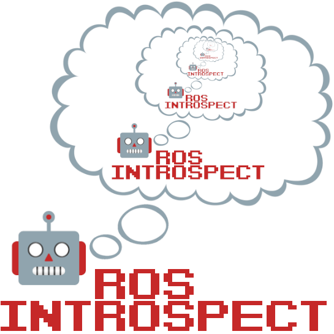

 `ros_introspect` is a Pure Python library for working with the files in ROS packages in a structured way.
It is compatible with both ROS 1 and ROS 2.

You can specify the path directly.

```
from ros_introspect import Package
package = Package('/full/path/geometry_msgs')
```
or you can use the built-in crawler to search recursively

```
from ros_introspect import find_packages

for package in find_packages('/home/dlu/ros2_ws/src'):
    print(package)
```


## The `Package` Class

A `Package` is a path where the `$PATH/package.xml` exists and a collection of `PackageFile`s that are contained within that folder.

Each of the package files are a subtype of `PackageFile` based on their functionality, with each of the subtypes being defined in `ros_introspect.components`, including...

 * `package.xml`
 * `CMakeLists.txt`
 * Source code (Python or C++)
 * ROS Interfaces, i.e. messages, services and actions
 * DynamicReconfig configurations (ROS 1 only)
 * Plugin XML, for use with `pluginlib`
 * Launch files, both `XML` (ROS 1) and Python (ROS 2)
 * Parameter files (`.yaml`)
 * RViz configurations (`.rviz`)
 * Robot model files (`.urdf` and `.xacro`)
 * `setup.py` and `setup.cfg` for Python code
 * Documentation (Markdown, RST, licenses, etc.)
 * Miscellaneous Config files (various metadata like the `.github` folder)

Everything that does not fall into one of those categories ends up as "Other"**

**Excluding `.pyc`, `*~`, and `.git/` files
